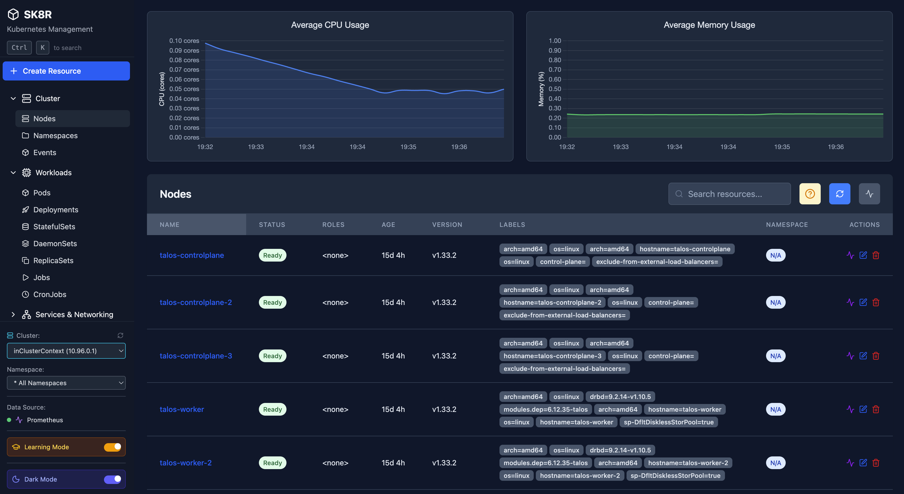

# sk8r - A Kubernetes Dashboard clone

sk8r is a modern, open-source dashboard for your Kubernetes cluster. It provides a user-friendly interface to visualize and manage your cluster resources, view logs, and monitor metrics.



## Features

-   **Resource Management:** View, create, and manage Kubernetes resources like Pods, Deployments, Services, etc.
-   **Real-time Logs:** Stream logs from your pods directly in the UI.
-   **Metrics:** Visualize cluster and application metrics with Prometheus integration.
-   **Interactive Pod Shell:** Access a terminal inside your running pods.

## Quick Start

Deploy sk8r to your Kubernetes cluster with a single command:

```sh
kubectl apply -f https://raw.githubusercontent.com/mvkdev/sk8r/main/k8s/rbac.yaml \
              -f https://raw.githubusercontent.com/mvkdev/sk8r/main/k8s/nodes-rbac.yaml \
              -f https://raw.githubusercontent.com/mvkdev/sk8r/main/k8s/deployment.yaml \
              -f https://raw.githubusercontent.com/mvkdev/sk8r/main/k8s/service.yaml
```

Or clone the repository and apply all manifests:

```sh
git clone https://github.com/mvkdev/sk8r.git
cd sk8r
kubectl apply -f k8s/
```

## Prerequisites

-   A running Kubernetes cluster
-   `kubectl` installed and configured to connect to your cluster
-   **(Optional) Prometheus:** For metrics visualization, the dashboard expects Prometheus to be available at `http://kube-prometheus-stack-prometheus.monitoring:9090`. We recommend installing the [kube-prometheus-stack](https://github.com/prometheus-community/helm-charts/tree/main/charts/kube-prometheus-stack) Helm chart.

## Accessing the Dashboard

The application is exposed via a `LoadBalancer` service. To find the external IP address:

```sh
kubectl get service sk8r-app-service -o jsonpath='{.status.loadBalancer.ingress[0].ip}'
```

Open your browser and navigate to the IP address returned by the command.

## Configuration

### Custom Namespace

By default, sk8r is deployed to the `default` namespace. To deploy to a different namespace:

```sh
kubectl create namespace sk8r
kubectl apply -f k8s/ -n sk8r
```

Note: You'll need to update the RBAC manifests to reference the correct namespace for the ServiceAccount.

### Prometheus URL

If your Prometheus instance is running at a different address, update the `PROMETHEUS_URL` environment variable in the deployment:

```yaml
env:
- name: PROMETHEUS_URL
  value: "http://your-prometheus-service:9090"
```

### Alternative Service Types

The default service type is `LoadBalancer`. For other environments:

**NodePort:**
```yaml
spec:
  type: NodePort
  ports:
    - port: 80
      targetPort: 3000
      nodePort: 30080  # Optional: specify a port
```

**ClusterIP with Ingress:**
```yaml
spec:
  type: ClusterIP
```

Then create an Ingress resource pointing to the `sk8r-app-service`.

---

## Contributing

### Development

To run the application locally for development:

1.  **Install dependencies:**
    ```sh
    npm install
    ```

2.  **Start the development server:**
    ```sh
    npm run dev
    ```
    The application will be available at `http://localhost:5173`.

### Building from Source

If you want to build and push your own Docker image:

1.  **Build and push the Docker image:**
    ```sh
    docker buildx build --platform linux/amd64,linux/arm64 -t your-registry/sk8r-app:latest --push .
    ```

2.  **Update the deployment to use your image:**
    ```sh
    kubectl set image deployment/sk8r-app sk8r-app=your-registry/sk8r-app:latest
    ```

    Or edit `k8s/deployment.yaml` to reference your image before applying.
